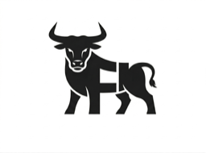

# @yf/ui

Reusable Vue 3 admin UI kit (shadcn-style components on UnoCSS).

## Usage in the template

The monorepo template consumes this package via the root pnpm workspace:

```json
"@yf/ui": "workspace:*"
```

Install and build from the repository root:

```bash
cd ..
pnpm install
pnpm --filter @yf/ui build
```

## Standalone development

```bash
pnpm install
pnpm dev        # playground
pnpm build      # library dist/
pnpm typecheck
```

## Exports

- `@yf/ui` — components, composables, utilities
- `@yf/ui/preset` — UnoCSS preset for consumer apps

## Charts

`LineChart`, `AreaChart`, `BarChart` and `DonutChart` wrap
[Unovis](https://unovis.dev) (`@unovis/vue` + `@unovis/ts`, pinned to matching
exact versions because Unovis peer-depends on itself by exact version).

```vue
<script setup lang="ts">
import { LineChart } from '@yf/ui'

const data = [{ month: new Date(2025, 0, 1), kuching: 18420, miri: 12980 }]
const series = [{ key: 'kuching', label: 'Kuching' }, { key: 'miri', label: 'Miri' }]
const money = (value: number) => `RM ${value.toLocaleString('en-MY')}`
</script>

<template>
  <LineChart :data="data" x="month" :series="series" :y-formatter="money" />
</template>
```

Series colours default to `--chart-1` … `--chart-5`, and `ChartContainer`
re-points Unovis's `--vis-*` variables at `--popover`, `--border` and
`--muted-foreground`, so charts follow light/dark and the runtime palette
switcher without extra work.

Two things a consuming app must know:

- `presetYfUi()` is required, not optional, for charts: it carries the rule that
  makes Unovis's container fill the height `ChartContainer` sets.
- If the app widens UnoCSS's `content.pipeline.include` to plain `.ts`/`.js`
  (the default does not include them), exclude `node_modules` as well. Unovis
  embeds raw CSS in template literals, which UnoCSS otherwise extracts into
  unparseable rules and the build fails:

  ```ts
  pipeline: {
    include: [/\.(vue|[jt]sx?)($|\?)/],
    exclude: [/[\\/]node_modules[\\/]/],
  },
  ```

## Blue colour theme

Blue is the default preset theme on this variant branch:

```ts
presets: [presetWind3(), ...presetYfUi()]
```

It provides a royal-blue primary, a pale-blue secondary surface, and a
cyan-blue tertiary role. Backgrounds, cards, popovers, muted and accent
surfaces, form controls, borders, and the sidebar all use coordinated blue
tints in light and dark mode.

All three roles use HSL CSS variables, so an application can still override
them in its global stylesheet to identify divisions, teams, or other roles:

```css
:root {
  --primary: 221.2 83.2% 53.3%;
  --primary-foreground: 210 40% 98%;
  --secondary: 210 40% 96.1%;
  --secondary-foreground: 222.2 47.4% 11.2%;
  --tertiary: 199 89% 38%;
  --tertiary-foreground: 0 0% 98%;
}

.dark {
  --primary: 217.2 91.2% 59.8%;
  --primary-foreground: 222.2 47.4% 11.2%;
  --secondary: 217.2 32.6% 17.5%;
  --secondary-foreground: 210 40% 98%;
  --tertiary: 198 93% 60%;
  --tertiary-foreground: 202 80% 12%;
}
```

The `ThemePalettePicker` lets users select component and background palettes
independently:

```vue
<script setup lang="ts">
import { ThemePalettePicker } from '@yf/ui'
</script>

<template>
  <ThemePalettePicker />
</template>
```

The selection persists in local storage and sets
`data-yf-component-theme` and `data-yf-background-theme` on the document root.
Available palettes are Neutral, Blue, Green, Orange, Rose, and Violet, each
with light and dark values.

Values are HSL channels without the surrounding `hsl()` so opacity modifiers
continue to work. The roles are available as UnoCSS colours such as
`bg-primary`, `bg-secondary`, `bg-tertiary`, and
`text-tertiary-foreground`. `Button` and `Badge` also accept
`variant="tertiary"`; their existing default and secondary variants use the
primary and secondary roles respectively.
